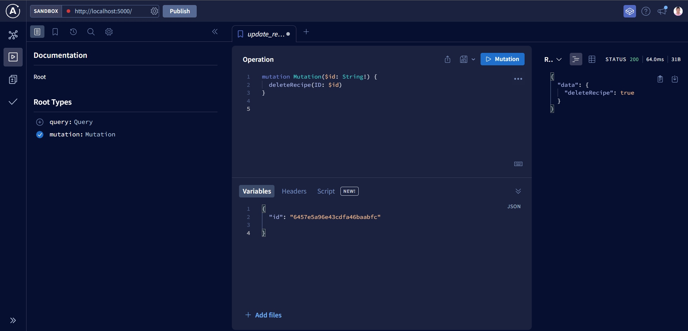

# Recipe Graphql API

Welcome to the Recipe Graphql API! This API allows you to retrieve, edit,
update, delete using GraphQL Queries.

here is the playground screenshot



## 🛠️ Built With

1. Node.js
2. Express.js
3. GraphQL
4. MongoDB
5. Apollo Server
6. Mongoose
7. Typescript

## 📋 Prerequisites

To run this project locally, you will need to have the following installed on
your machine:

1. Node.js
2. MongoDB
3. Yarn

## 🔧 Installation

To install this project, follow these steps:

1. Clone the repository
2. Run `yarn install` to install the dependencies
3. Create a `.env` file in the root directory and add the following variables:

```
MONGO_URI= "mongodb://127.0.0.1:27017/recipe-gql-api" || "your-mongo-atlas-uri"
```

4. Run `yarn dev` to start the server
5. Navigate to `http://localhost:5000/` to view the GraphQL Playground
6. You can now send queries to the API

## 🚀 Getting Started

To use this API, you can send a gql query and mutation to the following
endpoint:

```
https://localhost:5000/
```

## 📝 Query Examples

### Get all recipes

```
query Query {
  getRecipes {
    ID,
    category
    createdAt
    description
    name
    originated
    updatedAt
  }
}
```

This will return a JSON object with information about a recipe

### 📊 Response Format

The response from the API will be in the following format:

```
{
  "data": {
    "getRecipes": [
      {
        "ID": "60c0a0a0e1b3a1a0e8a0a0a0",
        "category": "test",
        "createdAt": "1683480182148",
        "description": "this is awesome Recipe",
        "name": "Test Recipe 2",
        "originated": "test origin",
        "updatedAt": "1683480182148"
      },
      {
        "ID": "60c0a0a0e1b3a1a0e8a0a0a0",
        "category": "test",
        "createdAt": "1683479768142",
        "description": "Test Description updated",
        "name": "Test Name",
        "originated": "test origin updated",
        "updatedAt": "1683480043516"
      }
    ]
  }
}
```

### Get a recipe by ID

```
query Query($ID: String!) {
  recipe(ID: $ID) {
    ID,
    category
    createdAt
    description
    name
    originated
    updatedAt
  }
}
```

### input

```
{
  "ID": "60c0a0a0e1b3a1a0e8a0a0a0"
}
```

### 📊 Response Format

```
{
  "data": {
    "recipe": {
      "ID": "60c0a0a0e1b3a1a0e8a0a0a0",
      "category": "test",
      "createdAt": "1683480182148",
      "description": "this is awesome Recipe",
      "name": "Test Recipe 2",
      "originated": "test origin",
      "updatedAt": "1683480182148"
    }
  }
}
```

## 📝 Mutation Examples

### Create a recipe

```
mutation Mutation($recipe: RecipeInput) {
  createRecipe(recipe: $recipe) {
    ID,
    category,
    createdAt,
    description,
    name,
    originated,
    updatedAt,
  }
}
```

### input

```
{
  "recipe": {
    "category": "test",
    "description": "this is awesome Recipe",
    "name": "Test Recipe 2",
    "originated": "test origin"
  }
}
```

### 📊 Response Format

```
{
  "data": {
    "createRecipe": {
        "ID": "60c0a0a0e1b3a1a0e8a0a0a0",
      "category": "test",
      "createdAt": "1683480182148",
      "description": "this is awesome Recipe",
      "name": "Test Recipe 2",
      "originated": "test origin",
      "updatedAt": "1683480182148"
    }
  }
}
```

### Update a recipe

```
mutation Mutation($ID: String!, $recipe: RecipeInput) {
  updateRecipe(ID: $ID, recipe: $recipe) {
    ID,
    category,
    createdAt,
    description,
    name,
    originated,
    updatedAt,
  }
}
```

### input

```
{
  "ID": "60c0a0a0e1b3a1a0e8a0a0a0",
  "recipe": {
    "category": "test",
    "description": "this is awesome Recipe",
    "name": "Test Recipe 2",
    "originated": "test origin"
  }
}
```

### 📊 Response Format

```
{
  "data": {
    "updateRecipe": {
        "ID": "60c0a0a0e1b3a1a0e8a0a0a0",
      "category": "test",
      "createdAt": "1683480182148",
      "description": "this is awesome Recipe",
      "name": "Test Recipe 2",
      "originated": "test origin",
      "updatedAt": "1683480182148"
    }
  }
}
```

### Delete a recipe

```
mutation Mutation($id: String!) {
  deleteRecipe(ID: $id)
}
```

### input

```
{
  "id": "60c0a0a0e1b3a1a0e8a0a0a0"
}
```

### 📊 Response Format

```
{
  "data": {
    "deleteRecipe": true
  }
}
```

## 👨‍💻 Contributing

If you would like to contribute to this project, feel free to fork the
repository and submit a pull request.

## 📝 License

This project is licensed under the MIT License - see the [LICENSE](LICENSE) file
for details.

# Happy Coding!
